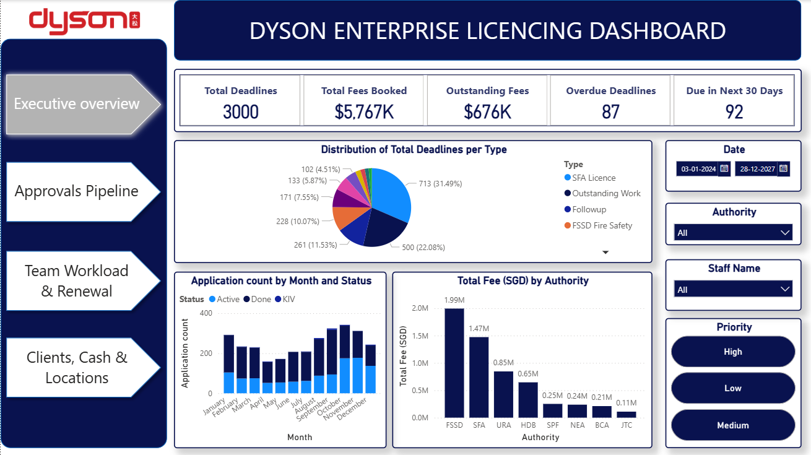
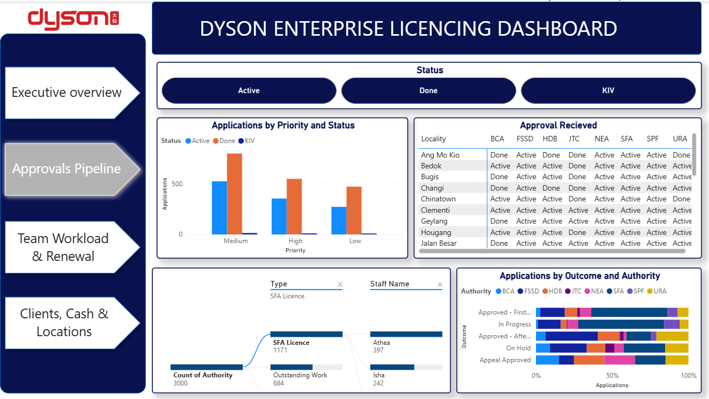
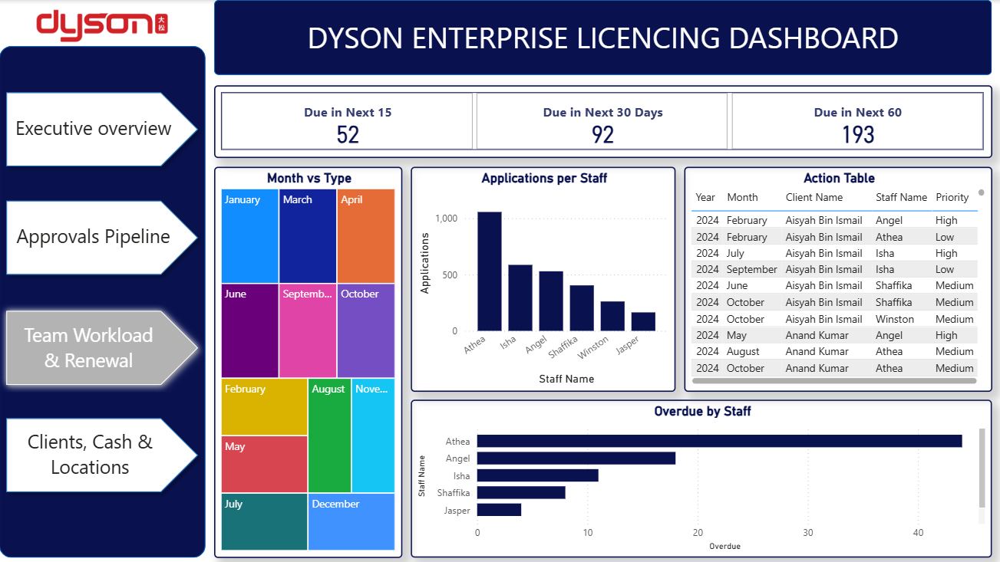
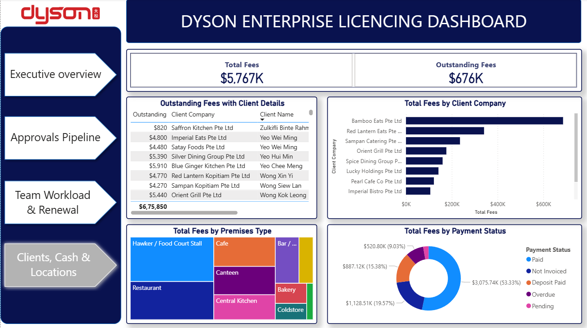
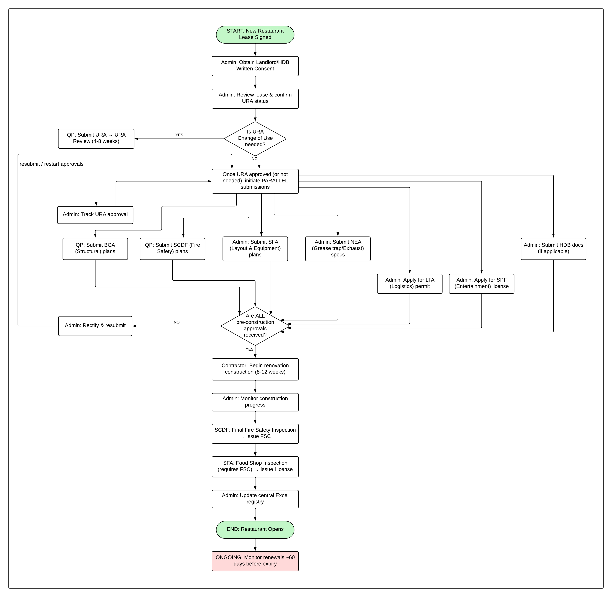

# Dyson Enterprise Licensing & Operations Project

## 📖 Executive Summary
Managing restaurant licensing involves coordinating with multiple government agencies, tracking strict deadlines, and managing large sums of money. Previously, this process was difficult to track manually, leading to delayed approvals and missed payments. 

To solve this, I mapped the entire licensing process using **Lucidchart** and built a centralized **Power BI** dashboard. This project gives management a clear, real-time view of project approvals, team workload, and outstanding fees, helping the business run more smoothly and efficiently.

##  The Problem: Complex Licensing Process
Opening a new restaurant requires approvals from up to eight different government agencies (such as URA, BCA, SCDF, and SFA).
*   **The Bottleneck:** The process is highly dependent on external agencies. If one agency delays an approval or requests a resubmission, the entire renovation and opening timeline is pushed back.
*   **The Risk:** With hundreds of licenses to manage, tracking renewal dates and approval statuses manually makes it easy to miss deadlines, which can lead to compliance fines or delayed business openings.

## 💡 The Solution: Centralized Power BI Dashboard
To fix these tracking issues, I designed a Power BI dashboard that acts as a single source of truth for the operations team. The dashboard is divided into four key sections:

### 1. Executive Overview (High-Level Health)
*   **What it shows:** Key numbers at a glance, such as Total Deadlines (3,000), Overdue Deadlines (87), and Total Fees Booked ($5.76 Million).
*   **Business Value:** Management can instantly see the overall health of the department and identify urgent issues, like the 92 licenses due in the next 30 days.

### 2. Approvals Pipeline (Project Tracking)
*   **What it shows:** A clear matrix showing exactly which agencies (BCA, FSSD, SFA, etc.) have approved which locations. It also tracks applications by priority (High, Medium, Low).
*   **Business Value:** The team no longer needs to search through emails to find out if a permit is approved. They can see the exact status of every location in one place, speeding up the renovation process.

### 3. Team Workload & Renewals (Resource Management)
*   **What it shows:** How many applications each staff member is handling, and a clear list of who has overdue tasks.
*   **Business Value:** This helps managers balance the workload fairly. If one staff member has too many overdue tasks, the manager can reassign work to ensure no deadlines are missed.

### 4. Clients, Cash & Locations (Financial Tracking)
*   **What it shows:** Total fees collected versus outstanding fees ($676,000). It breaks down the money by client, premises type (e.g., Cafe, Restaurant), and payment status.
*   **Business Value:** It links daily operations to revenue. The finance and admin teams can easily see which clients still owe money and follow up immediately to improve cash flow.

##  Dashboard Visuals

### Executive Overview

### Approvals Pipeline

### Team Workload

### Clients & Financials

## 🔄 Process Workflow
I also mapped the end-to-end process to identify bottlenecks.

##  Business Impact and Results
By moving from manual tracking to this automated dashboard, the business achieves several key goals:
1.  **Reduced Risk:** Easily track overdue deadlines (87 identified) and prevent compliance issues.
2.  **Faster Openings:** Clear visibility of agency approvals helps the team push projects forward, allowing restaurants to open on time.
3.  **Better Cash Flow:** Highlighting the $676,000 in outstanding fees allows the team to collect payments faster.
4.  **Time Saved:** The team spends less time updating spreadsheets and more time managing operations and clients.

## 🛠️ Tools Used
*   **Power BI:** Data cleaning, visualization, and dashboard creation.
*   **Lucidchart:** Process mapping and workflow optimization.

## 📁 Repository Structure
*   `business-analysis-report.pdf`: Detailed written report of the project.
*   `dashboard.pbix`: The Power BI source file.
*   `workflow-diagram.pdf`: The process map created in Lucidchart.
